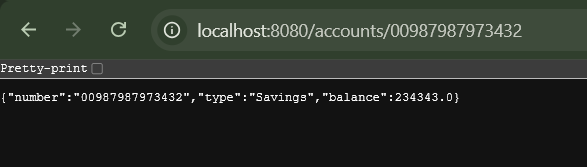
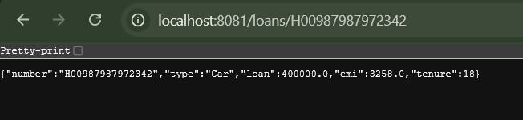

# Week 4 - Microservices with Spring Boot 3 and Spring Cloud

## Exercise: Creating Microservices for Account and Loan

### Account Microservice

- Port: 8080
- Endpoint:
  http://localhost:8080/accounts/00987987973432

#### Output

---

### Loan Microservice

- Port: 8081
- Endpoint:
  http://localhost:8081/loans/H00987987972342

#### Output

---

## Technologies Used

- Spring Boot 3.5.16
- Spring Web
- Spring Boot DevTools
- Maven
- Java 17