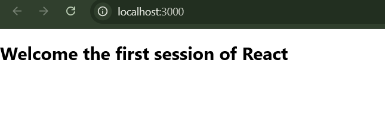
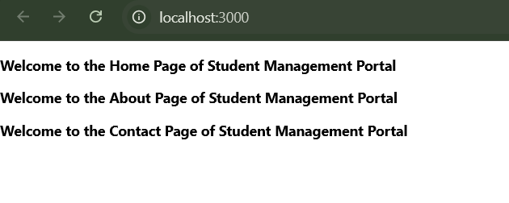
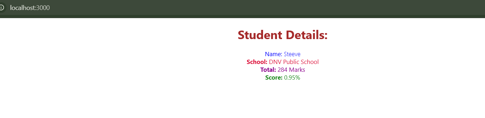
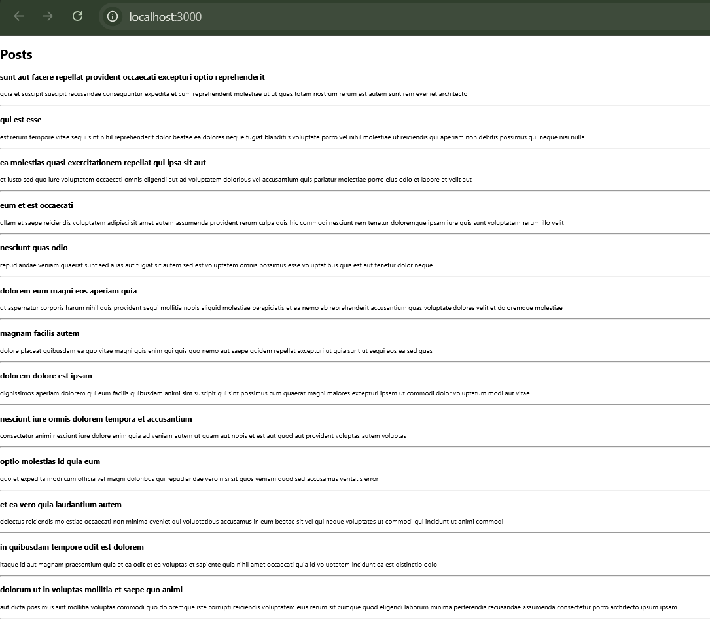
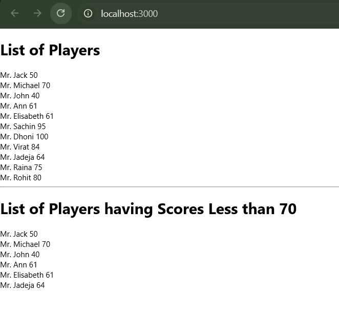
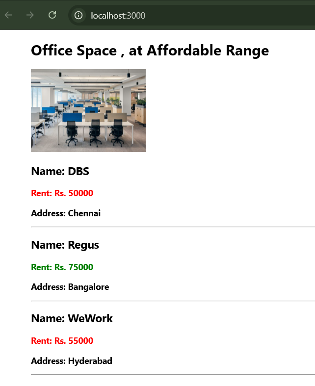
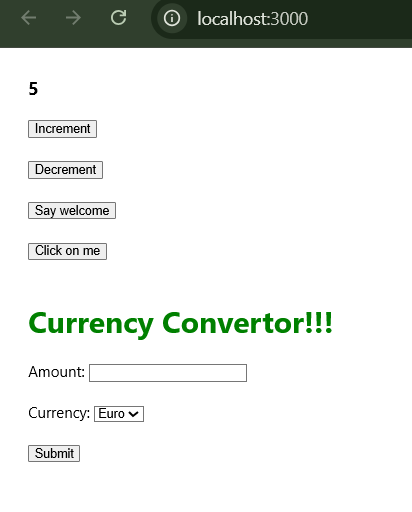
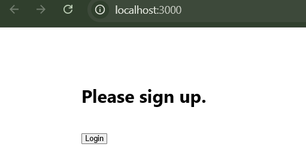
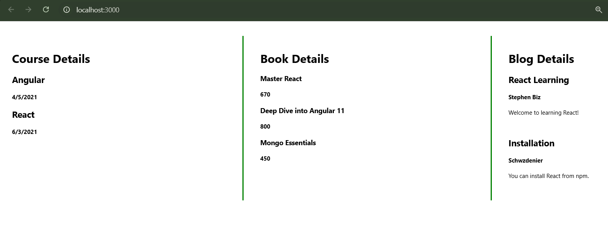

# Week 5 - React

This directory contains the mandatory React hands-on exercises completed as part of the Cognizant Digital Nurture Program.

---

## Exercise 1 - My First React Application

**Project:** `myfirstreact`

### Objective
- Create a React application using Create React App.
- Display a simple welcome message.

### Output



---

## Exercise 2 - Student Management Portal

**Project:** `studentapp`

### Objective
- Create Home, About and Contact components.
- Render all components using App.js.

### Output



---

## Exercise 3 - Score Calculator

**Project:** `scorecalculatorapp`

### Objective
- Create a functional component.
- Calculate and display student score.
- Apply CSS styling.

### Output



---

## Exercise 4 - Blog Application

**Project:** `blogapp`

### Objective
- Fetch posts from JSONPlaceholder API.
- Display blog posts using React lifecycle methods.

### Output



---

## Exercise 5 - Cohort Tracker Styling

### Objective
- Style React components using CSS Modules.
- Apply custom styling to cohort details.

### Output



---

## Exercise 6 - Cricket Application (ES6 Features)

**Project:** `cricketapp`

### Objective
- Use ES6 features like map(), filter(), destructuring and spread operator.
- Demonstrate conditional rendering.

### Output



---

## Exercise 7 - Office Space Rental Application

**Project:** `officespacerentalapp`

### Objective
- Render office details using JSX.
- Apply conditional styling based on office rent.

### Output



---

## Exercise 8 - React Event Handling

**Project:** `eventexamplesapp`

### Objective
- Handle button click events.
- Implement a simple currency converter.

### Output



---

## Exercise 9 - Ticket Booking Application

**Project:** `ticketbookingapp`

### Objective
- Implement Login and Logout functionality.
- Demonstrate conditional rendering.

### Output



---

## Exercise 10 - Blogger Application

**Project:** `bloggerapp`

### Objective
- Display Book, Blog and Course details.
- Implement different approaches to conditional rendering.

---

## Technologies Used

- React
- JavaScript (ES6)
- JSX
- HTML5
- CSS3
- Node.js
- npm
- Create React App

---

## Folder Structure

```text
React
│
├── blogapp
├── bloggerapp
├── cricketapp
├── eventexamplesapp
├── myfirstreact
├── officespacerentalapp
├── scorecalculatorapp
├── studentapp
├── ticketbookingapp
│
└── screenshots
    ├── ex1.png
    ├── ex2.png
    ├── ex3.png
    ├── ex4.png
    ├── ex9.png
    ├── ex10.png
    ├── ex11.png
    ├── ex12.png
    └── ex13.png
```

---

## Author

**Advaidh Baskar**